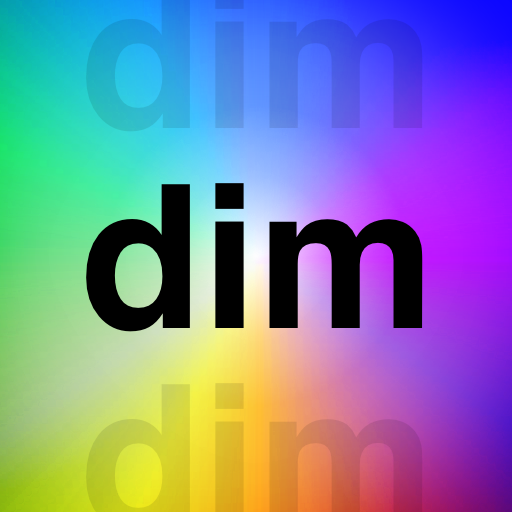

# dim



Define rules to reduce opacity of repeating lines or blocks to be able to focus in main logic.

## Features

-   Use simple **regex** rules to describe which part of the code will be dimmed.
-   Use `rule` property to make the rule single-line (part of line that matches will be dimmed)
-   Use `startRule` and `endRule` to make the rule multi-line (matching block of code will be dimmed)
-   Write per-workspace rules in `.vscode/config.json` under `dim.rules`
-   Write per-language rules under file tags: `[js]`, `[go]`, `[json]`
-   3 opacity tier: min, mid, max. Defaulted to 0.25, 0.50, 0.75 opacities.

## Simple usage

```json
{
    "[go]": {
        "dim.rules": [
            {
                "startRule": ".* err != nil",
                "endRule": "}"
            }
        ]
    }
}
```

## Detailed usage

Below code demonstrates, 2 per-language rule as well as one per-workspace rule.

-   The rule defined for go is multi-line since it has `startRule` and `endRule` properties.
-   The workspace-wide rule and the rule defined for json are single-line rules since they only have `rule` property.
-   `opacityTier` can be defined per-rule, if another tier then the `defaultOpacityTier` is desired.
-   `defaultScanLimit` is to limit **dim** to search only the first `n` lines of codefiles. Higher values can decrease the performance.
-   `maxLinesBetween` is to limit **dim** to search match for the `endRule` only `n` lines after the the text matches with `startRule`

```json
{
    "[json]": {
        "dim.rules": [
            {
                "rule": ".*\\$.*" // eg: $schema, $url
            }
        ]
    },
    "[go]": {
        "dim.rules": [
            {
                "startRule": "if err != nil",
                "endRule": "}",
                "opacityTier": "min",
                "maxLinesBetween": 20
            }
        ]
    },
    "dim.rules": [
        {
            "rule": "//.*", // comments
            "opacityTier": "max"
        }
    ],
    "dim.defaultOpacityTier": "mid",
    "dim.defaultScanLimit": 500,
    "dim.defaultMaxLinesBetween": 5,
    "dim.valueForMinTier": 0.2,
    "dim.valueForMidTier": 0.3,
    "dim.valueForMaxTier": 0.4
}
```

## Known Issues

-   `sameScope` switch for rules is under development, may not work appropriately.

## Todo

-   [ ] Option to leave the inner-area of `startRule` and `endRule` matching texts without dimming: `leaveBetween`
-   [ ] Context like usage with multiline rule property `subRules`
-   [ ] Performance optimization for extension lifecycle events

## Contribution

-   Issues and PRs => https://github.com/ufukty/dim

## License

-   See [LICENSE](LICENSE) file

## See also

-   dim has inherited some code and logic from https://github.com/lorefnon/lowlight-patterns
