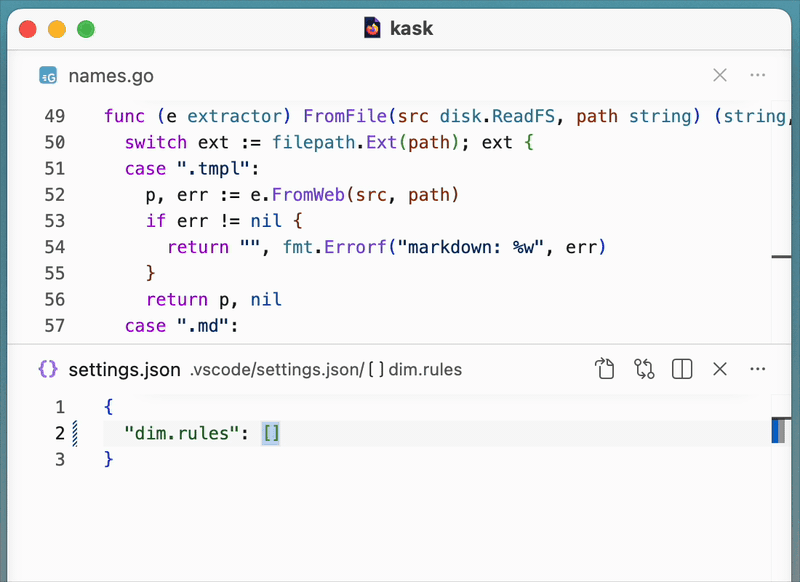
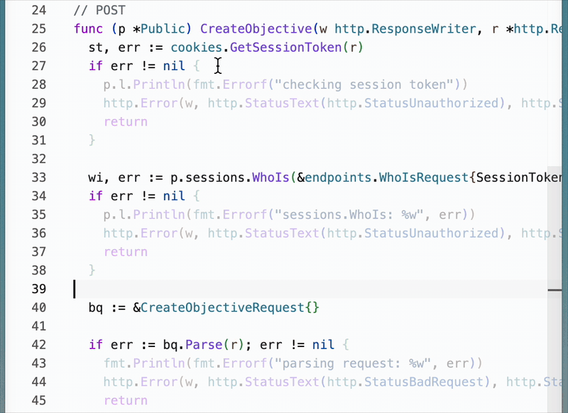
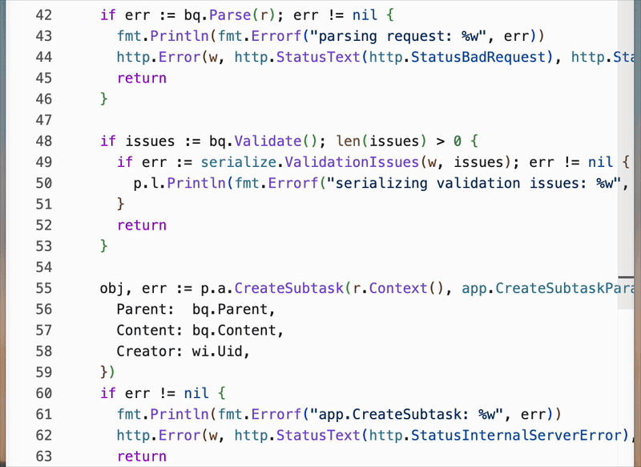
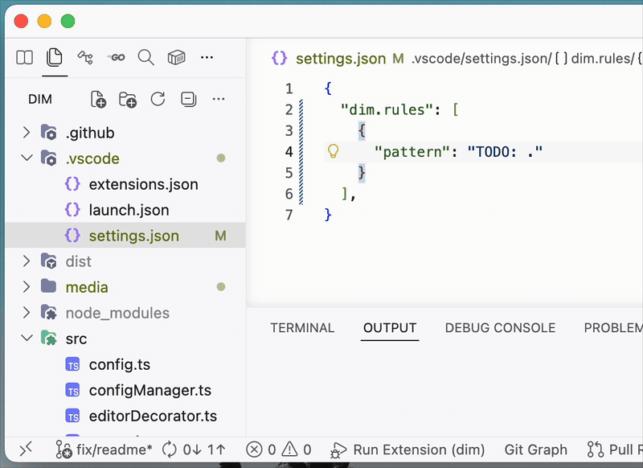
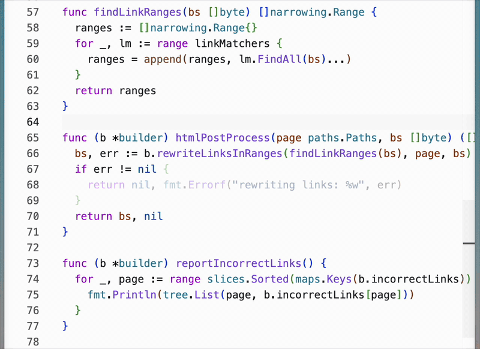
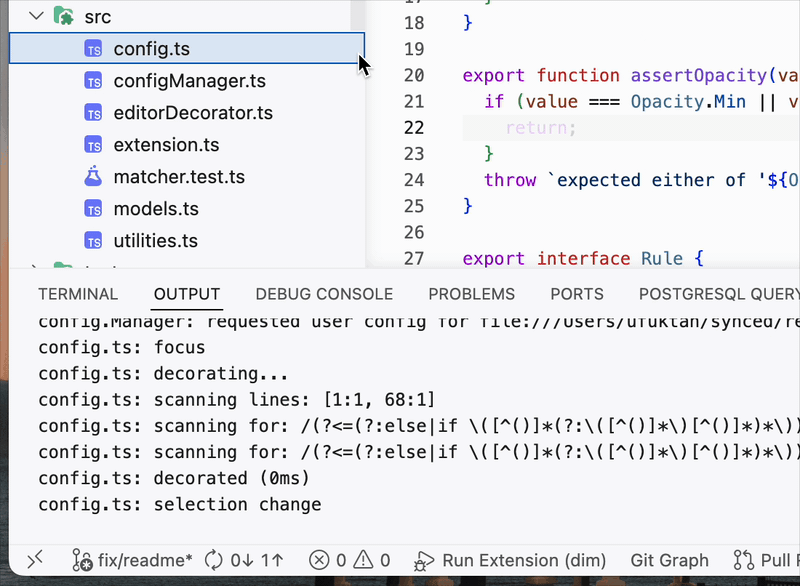
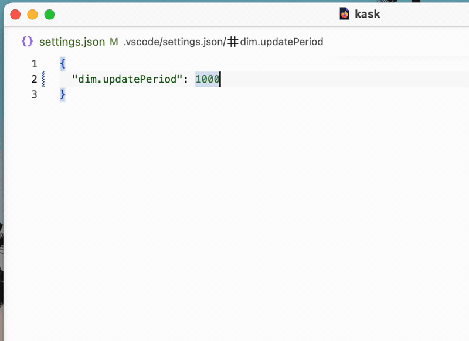

# Dim

Focus on the main logic more easily by dimming the details.

- Familiar
- Customizable
- Non-invasive
- Polyglot
- Responsive
- Lightweight

## Features

Dim is many things but not dim.

### Familiar

Dim is configured using regular expressions. Adopt it quickly and build up over time.



### Restrained

Dim doesn't get in the way when user wants to work on details.



### Respectful

During thorough readings Dim can be disabled per document. See also [Toggling with Keyboard](#toggling-dim-with-keyboard).



### Polyglot

Dim accepts language-specific rules as well.

```jsonc
{
  "[javascript]": {
    "dim.rules": [
      {
        "pattern": "console\\.log\\(.*?\\)",
      },
    ],
  },
}
```

### Organized

Set defaults for RegEx flags and the opacity tier at root. All rules inherit them unless override.

```jsonc
{
  "dim.defaultOpacityTier": "min",
  "dim.valueForMinTier": 0.2,
  "dim.valueForMidTier": 0.3,
  "dim.valueForMaxTier": 0.4,
}
```

### Consistent

Rules accept opacity tiers instead of direct values. Tweak defaults and they'll be applied everywhere.

```jsonc
{
  "dim.rules": [
    { "pattern": "FIXME: .*", "opacity": "max" }
    { "pattern": "TODO: .*", "opacity": "mid" }
    { "pattern": "DONE: .*" } // "min"
  ]
}
```

### Forgiving

Dim checks for brace balance (`{` `}`) inside matches to prevent eye irritation and performance problems that would arise when incomplete sections of code cause a rule to match into the next section's ending. (Experimental)

## Performance

Dim is designed for speed.

### Peek fast

Dim doesn't run on scroll, so you can peek fast.


### Caching compiled RegExes

Dim caches the compiled RegExes for faster refreshes after selection and content changes as well as switching tabs.



### One pass per rule

Where some competitors iterate lines one-by-one looking for `<start>` and `<end>` tokens, Dim runs each rule against the full-text.

### Reduced flicker

Dim preserves the unaffected decorations from the previous cycle to reduce flicker.



### Robust lifecycle tracking

Dim runs after each document reveal, content and config change, and selection change, balancing responsiveness and performance.



### Adjustable

Dim can be adjusted to react faster and more frequently to user events as the hardware allows.



### Lightweight

Dim is a zero-dependency, bundled extension that activates in around `5ms`.

## Example configuration

```jsonc
{
  "[go]": {
    "dim.rules": [
      {
        // Dim Go's error wrapping blocks to "mid" tier.
        "pattern": "if err != nil {.*?}",
        "flags": "gs",
        "opacity": "mid",
      },
    ],
  },
  "[javascript]": {
    "dim.rules": [
      {
        // Dim the console.log calls including the args.
        "pattern": "console\\.log\\(.*?\\)",
      },
    ],
  },
  "dim.rules": [
    {
      // Dim the comment lines
      "pattern": "//.*",
      "opacity": "max",
    },
  ],
  "dim.defaultFlags": "g",
  "dim.defaultOpacityTier": "min",
  "dim.valueForMinTier": 0.2,
  "dim.valueForMidTier": 0.3,
  "dim.valueForMaxTier": 0.4,
}
```

## Suggestions

### Use code completion

Package file contains the configuration schema. Use code completion for configuration details.

### Escaping RegExes inside JSON

Escape patterns with backslashes as shown in the examples.

### Start simple

Some find RegEx cluttered. Some find it familiar and capable. If that's not you, just start simple and improve the rules over time.

### Nested scopes

Patterns that allow nested scopes improve the user experience noticeably. See [the test configuration](https://github.com/ufukty/dim/blob/main/test/.vscode/settings.json) for more examples.

For example, this lil' one combines lookarounds and single line mode with a "strange" pattern to dim the conditional branches of if statements without the condition expression itself, and allows one level of nesting with additional parentheses and braces. ([Regex101](https://regex101.com/?regex=%28%3F%3C%3D%28%3F%3Aelse%7Cif+%5C%28%5B%5E%28%29%5D*%28%3F%3A%5C%28%5B%5E%28%29%5D*%5C%29%5B%5E%28%29%5D*%29*%5C%29%29+%7B%29%5B%5E%7B%7D%5D*%28%3F%3A%7B%5B%5E%7D%5D*%7D%5B%5E%7B%7D%5D*%29*%28%3F%3D%7D%29&testString=if+%28condition%29+%7B%0A++.%0A%7D+else+if+%28expression%28%29%29+%7B%0A++%7B%7D%0A%7Delse+%7B%0A++%7B%7D+%7B%7D%0A%7D&flags=gs&flavor=javascript&delimiter=%2F))

```jsonc
{
  "[typescript]": {
    "dim.rules": [
      {
        "pattern": "(?<=(?:else|if \\([^()]*(?:\\([^()]*\\)[^()]*)*\\)) {)[^{}]*(?:{[^}]*}[^{}]*)*(?=})",
        "flags": "gs",
      },
    ],
  },
}
```

### Matching blocks

Use RegEx's single-line `s` mode for matching blocks. ([MDN](https://developer.mozilla.org/en-US/docs/Web/JavaScript/Guide/Regular_expressions#advanced_searching_with_flags), [StackOverflow](https://stackoverflow.com/questions/918806/difference-between-regular-expression-modifiers-or-flags-m-and-s))

### Toggling Dim with keyboard

Create a keyboard binding. Open the command palette and find: `Preferences: Open Keyboard Shortcuts (JSON)`. Then add a new entry.

```json
{
  "key": "alt+cmd+h",
  "command": "dim.toggleDimForCurrentEditor"
}
```

## Discussions

[GitHub Discussions](https://github.com/ufukty/dim/discussions) is open for users to report bugs, suggest features and ask questions.

## Prior work

Dim has inherited some code and logic from [lowlight-patterns](https://github.com/lorefnon/lowlight-patterns).

## License

See [LICENSE](LICENSE) file
